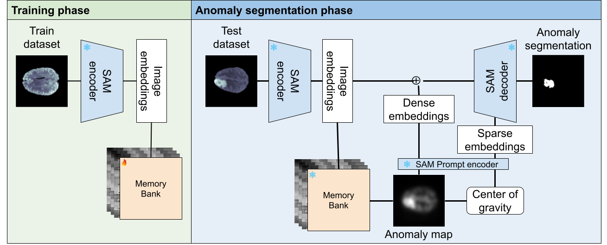
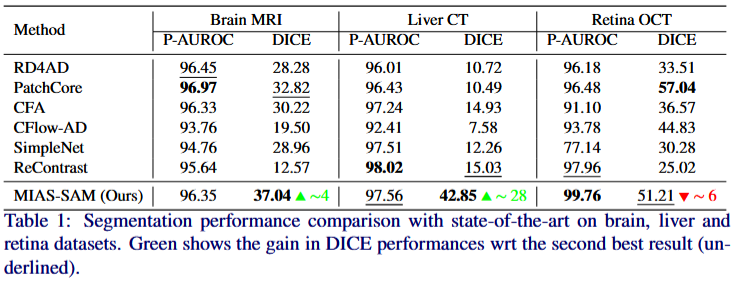

# Official implementation of MIAD-SAM (Submitted to MICCAI25)

<p align="center">

</p>

## Setup and run

1. Clone the repository
```bash
git clone anonymized_link
cd MIAD-SAM
```

2. Install dependencies
```bash
python3 setup.py
```

3. Prepare the data

<a href="https://github.com/DorisBao/BMAD">Download</a> the datasets (or prepare your own)

Dataset should have the following structure:
```bash
./datasets/{dataset}/train/good/{images} #Normal train data
./datasets/{dataset}/test/test/good/{images} #Normal test data
./datasets/{dataset}/test/test/Ungood/{images} #Anomalous test data
./datasets/{dataset}/test/test_labels/good/{images} #Empty normal GT (black images)
./datasets/{dataset}/test/test_labels/Ungood/{images} #Anomalous test data GT images
```

<a href="https://github.com/facebookresearch/segment-anything">Download</a> the pretarined weights of SAM (or your pretrained ones)

Place the weights under `./checkpoints`

4. Run the code!

```bash
python3 run_miad.py
```
Parameters:
```yaml
device: Select the device to run the code {cuda}
dataset: name of the dataset {BRAIN}
size: dataloader desired shape
save: log images
load: load Faiss index
```

## Results

<p align="center">

</p>